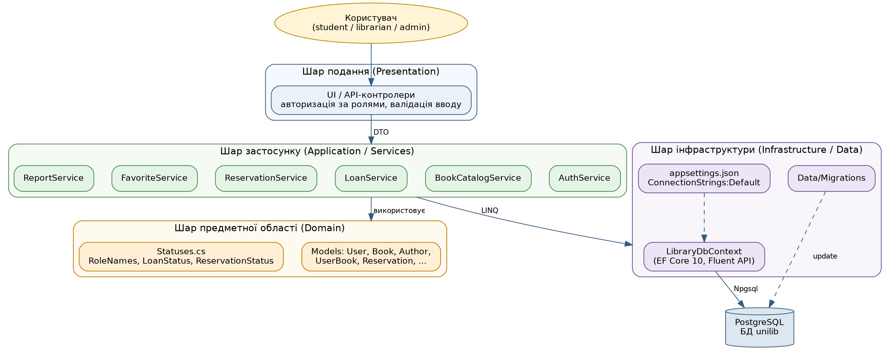
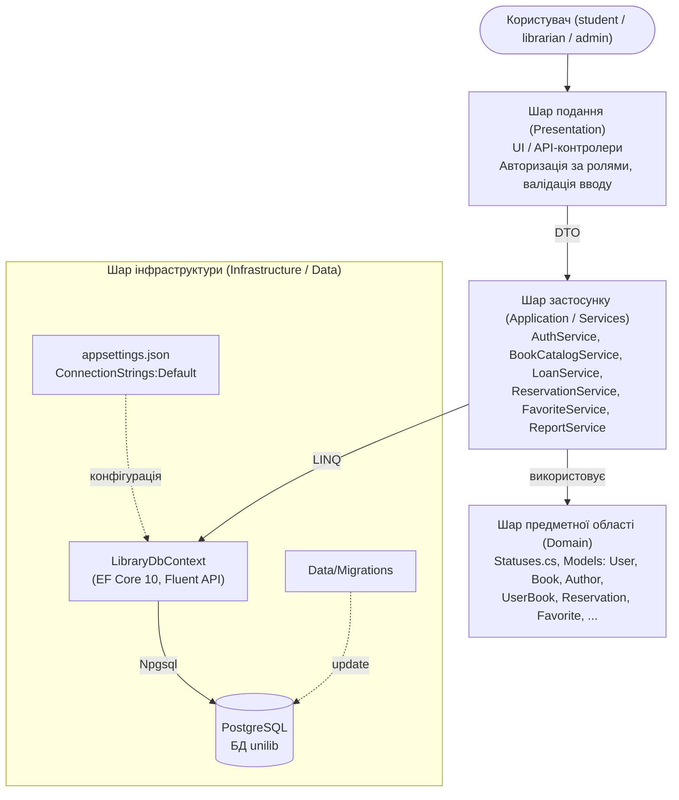
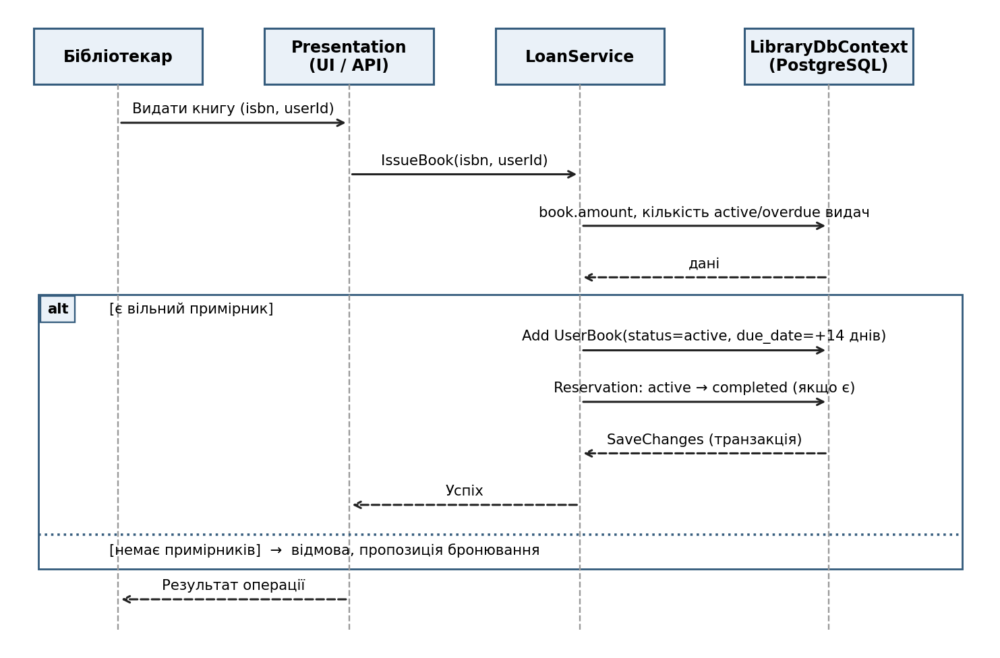
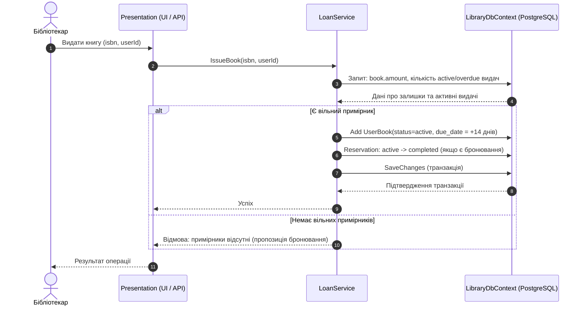
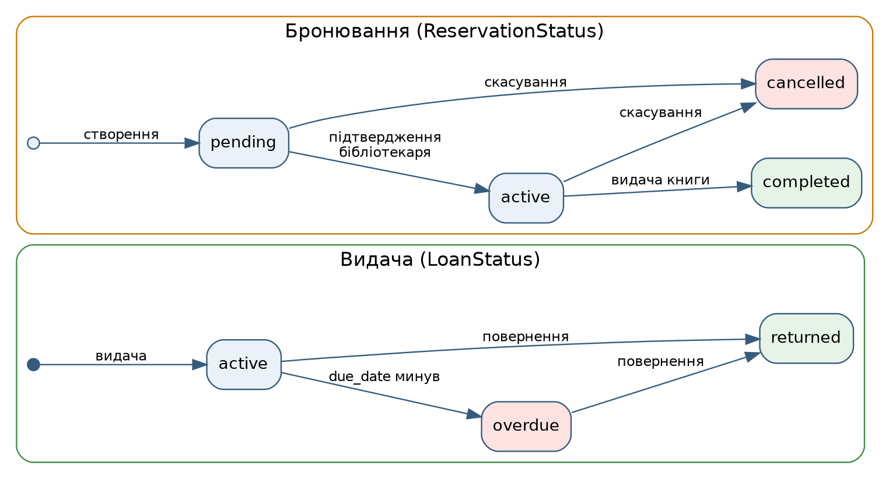
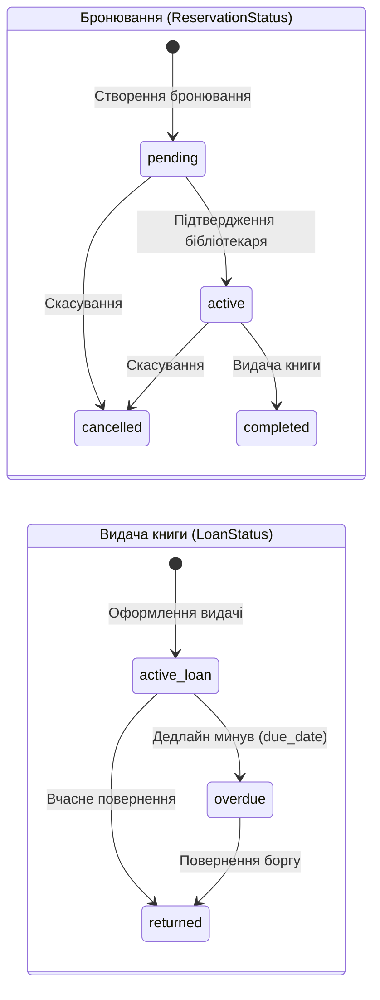
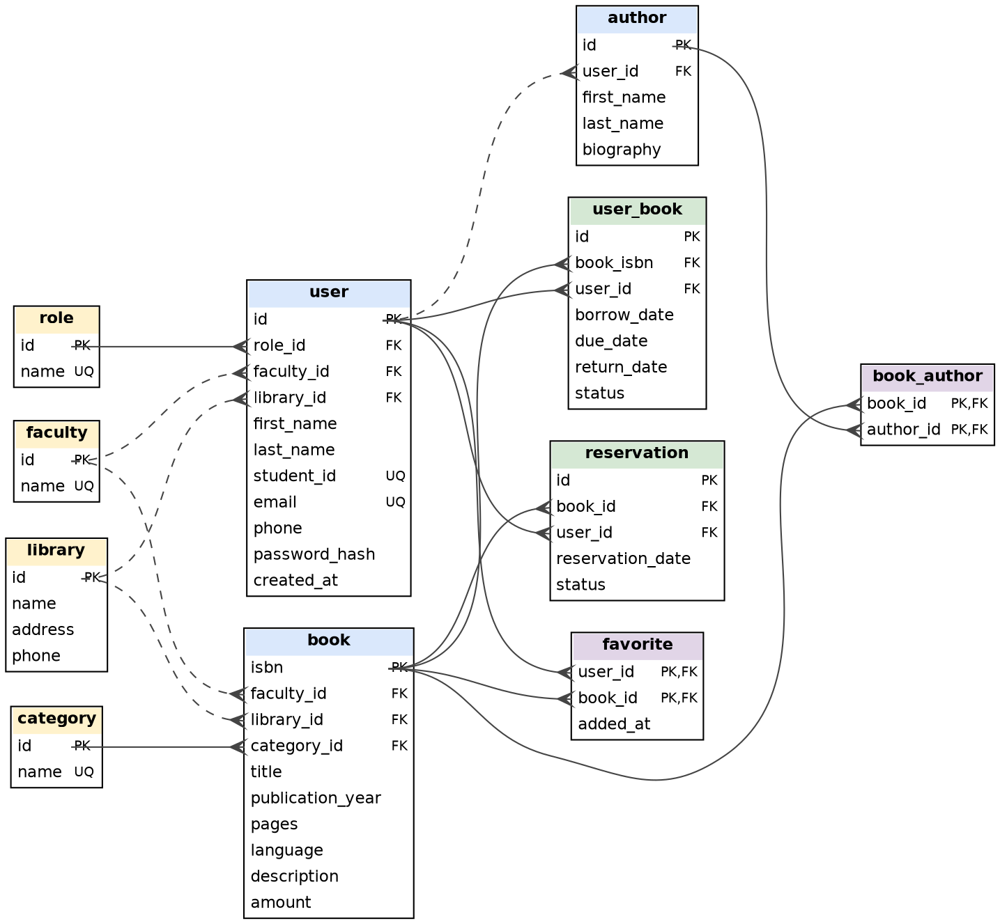

# Львівський національний університет імені Івана Франка

**Факультет прикладної математики та інформатики**  
Кафедра програмування

## Звіт
### етапу виконання проєкту №4

**«Проєктування архітектури та даних інформаційної системи "UniLib"»**

**Виконали:** студенти групи ПМІ-33

- Вербова Надія Андріївна
- Махновець Богдан Вікторович
- Митюк Маркіян Андрійович
- Нагірняк Вікторія Іванівна

**Перевірив:** ас. Галамага Любомир Борисович

---

## 1. Призначення системи та вихідні умови

**UniLib** — інформаційна система управління університетською бібліотекою, орієнтована на забезпечення сучасного читацького досвіду студентів та автоматизацію операційної діяльності бібліотечного персоналу. Система веде інтегрований каталог книг та авторів, здійснює облік видач і повернень примірників, керує процесами бронювання, підтримує персональні списки обраного та розмежовує права доступу на основі рольової моделі (адміністратор, бібліотекар, студент).

### 1.1. Вихідні умови та технологічний контекст

- **Платформа виконання:** .NET 10, сучасна ORM Entity Framework Core 10.
- **Система управління базами даних:** реляційна СУБД **PostgreSQL** (використовується провайдер `Npgsql.EntityFrameworkCore.PostgreSQL 10.0.3`).
- **Конвенція іменування:** база даних проєктується за угодою `snake_case` (забезпечується пакетом `EFCore.NamingConventions`), що відповідає ідіоматичному стилю PostgreSQL без необхідності екранування ідентифікаторів у SQL-запитах, тоді як у C#-коді зберігається стандартний `PascalCase`.
- **Шар збереження даних:** реалізовано клас `LibraryDbContext`, розроблено 11 нормалізованих доменних сутностей та згенеровано базову міграцію `InitialCreate`.
- **Ізоляція представлення:** шар подання проєктується поверх незалежного сервісного шару бізнес-логіки. Архітектура дозволяє підключати як настільний клієнт (Windows Forms / WPF / Avalonia), так і вебклієнт або RESTful API на базі ASP.NET Core Web API без зміни ядра системи.

---

## 2. Архітектурний підхід

Для системи **UniLib** обрано класичну **багатошарову архітектуру (Layered Architecture)** з односпрямованим потоком керування та суворими односпрямованими залежностями: вищі шари звертаються до нижчих, але нижчі ніколи не знають про реалізацію вищих.

Доступ до постійного сховища даних суворо інкапсульовано через інфраструктуру Entity Framework Core, чиї класи `DbContext` та `DbSet<T>` нативно реалізують патерни **Unit of Work** та **Repository**, усуваючи потребу в надлишкових користувацьких обгортках.

### 2.1. Розподіл шарів системи

| Шар | Відповідальність | Реалізація в проєкті |
|---|---|---|
| **Presentation** | Взаємодія з користувачем, отримання команд, валідація вхідних даних, авторизація дій за ролями, візуалізація відповідей | Інтерфейсні форми (UI) / API-контролери |
| **Application (Services)** | Інкапсуляція бізнес-правил, координація сценаріїв: видача та повернення книг, контроль лімітів, підтвердження бронювань, пошук за фільтрами | `BookService`, `LoanService`, `ReservationService`, `AuthService`, `FavoriteService`, `ReportService` |
| **Domain** | Опис предметних сутностей, визначення інваріантів, константи системних ролей та допустимих статусів | Моделі `unilib.Models.*`, константи `Statuses.cs` |
| **Infrastructure (Data)** | Об'єктно-реляційне відображення (ORM), виконання міграцій, транзакційне збереження, конфігурація підключення | `LibraryDbContext`, Fluent API, каталог `Data/Migrations`, файл `appsettings.json` |

### 2.2. Обґрунтування вибору архітектури

1. **Відповідність типу системи:** UniLib є системою з чітко вираженою бізнес-логікою обліку операцій (терміни, доступність екземплярів, статуси замовлень) та переважанням CRUD-запитів. Для масштабу проєкту багатошарова структура є оптимальною, легкою в навігації та підтримці, тоді як розподілені мікросервіси чи повне розділення команд і запитів (CQRS/Event Sourcing) спричинили б надмірне ускладнення кодової бази без реальної бізнес-вигоди.
2. **Ізоляція бізнес-правил:** правила обліку бібліотечного фонду та обчислення залишків сконцентровані в єдиному шарі сервісів і не дублюються в елементах призначеного для користувача інтерфейсу.
3. **Гнучкість модульного тестування:** контекст `LibraryDbContext` спроєктовано з підтримкою ін'єкції параметрів через конструктор `DbContextOptions<LibraryDbContext>`, що дозволяє підміняти підключення на ізольовану In-Memory базу даних (SQLite In-Memory або EF Core InMemory) під час виконання тестів без потреби у піднятті екземпляра PostgreSQL.





---

## 3. Структура програмного рішення

Фізична та логічна організація кодової бази відповідає обраній багатошаровій моделі:

```text
unilib/
├── appsettings.json              # Конфігурація підключення (ConnectionStrings:Default)
├── Models/                       # Domain (сутності предметної області)
│   ├── Role.cs, Faculty.cs, Category.cs, Library.cs   # Довідники та класифікатори
│   ├── User.cs, Author.cs, Book.cs                    # Основні сутності каталогу та користувачів
│   ├── BookAuthor.cs, Favorite.cs                     # Таблиці зв'язків M:N зі складеними ключами
│   ├── UserBook.cs                                    # Операції видачі та обліку позик
│   ├── Reservation.cs                                 # Бронювання примірників читачами
│   └── Statuses.cs                                    # Константи: RoleNames, LoanStatus, ReservationStatus
├── Data/                         # Infrastructure (доступ до бази даних)
│   ├── LibraryDbContext.cs       # Контекст EF Core з конфігурацією Fluent API
│   └── Migrations/               # Сформовані міграції схеми БД (InitialCreate та наступні)
├── Services/                     # Application (сервісний шар бізнес-логіки)
│   ├── ServiceBase.cs            # Базовий сервіс з фабрикою короткоживучих контекстів
│   ├── AuthService.cs            # Реєстрація, автентифікація, соління та гешування паролів
│   ├── BookService.cs            # Каталог книг, універсальний пошук, розрахунок доступності
│   ├── LoanService.cs            # Видача, повернення, контроль термінів користування
│   ├── ReservationService.cs     # Життєвий цикл попередніх замовлень
│   ├── FavoriteService.cs        # Керування списком збережених книг читача
│   └── ReportService.cs          # Формування аналітичних звітів (боржники, популярні книги)
└── Presentation/                 # Presentation (графічні форми UI або контролери API)
    ├── Form1.cs                  # Головне робоче вікно та координація модулів UI
    └── Program.cs                # Точка входу в застосунок
```

> **Стан компонентів:** Каталоги `Models/` та `Data/` реалізовано й перевірено міграцією бази даних. Каталоги `Services/` та `Presentation/` представляють цільові рівні, що проєктуються в межах цієї архітектурної специфікації та розгортаються на наступних етапах життєвого циклу проєкту.

---

## 4. Основні компоненти та їхня відповідальність

### 4.1. Специфікація компонентів

| Компонент | Шар | Відповідальність та функції |
|---|---|---|
| **Presentation** | Presentation | Приймає запити користувача, перевіряє роль для доступу до функцій, формує виклики сервісів, конвертує моделі у вигляд, придатний для відображення (DTO/ViewModel). |
| **AuthService** | Application | Забезпечує самостійну реєстрацію читачів, вхід у систему, безпечне соління та гешування паролів (у БД зберігається виключно `password_hash`), зміну пароля користувачем. |
| **BookCatalogService** | Application | Повний спектр операцій з каталогом: додавання й редагування книг, прив'язка авторів, розширений пошук за назвою, прізвищем автора, ISBN, категорією та факультетом. |
| **LoanService** | Application | Фіксація видачі та повернення літератури; перевірка фізичної наявності примірників; автоматичний розрахунок граничного терміну повернення (`due_date`); маркування статусів `overdue`. |
| **ReservationService** | Application | Створення черги бронювань читачами (стан `pending`), підтвердження заявки бібліотекарем (`active`), облік скасування (`cancelled`) або видачі книги (`completed`). |
| **FavoriteService** | Application | Додавання обраних книг користувачем до персонального списку бажаного, видалення записів, швидкий перегляд збереженої літератури. |
| **ReportService** | Application | Генерація адміністративної та бібліотечної аналітики: списки читачів-заборговаників, статистика популярності книг, читацька активність у розрізі факультетів. |
| **LibraryDbContext** | Infrastructure | Відображення доменних класів на реляційні таблиці, тонке налаштування обмежень через Fluent API, генерація запитів за угодою `snake_case`, керування транзакціями (`SaveChanges`). |
| **Statuses.cs** | Domain | Централізоване джерело нормативних констант системи: системні ролі, допустимі стани видач та життєвого циклу бронювань. |

### 4.2. Рольова модель та розмежування прав

1. **Адміністратор (`admin`):** повний контроль над системними довідниками (факультети, категорії), реєстрація бібліотечних філій (`library`), керування обліковими записами працівників і користувачів, конфігурація системи.
2. **Бібліотекар (`librarian`):** обслуговування читачів на кафедрі видачі, створення записів про видачу примірників, реєстрація повернення книг, підтвердження та обробка заявок на бронювання, управління каталогом власного бібліотечного відділення.
3. **Студент / Читач (`student`):** вільний перегляд електронного каталогу книг, пошук літератури за фільтрами факультетів та авторів, бронювання доступних видань, наповнення персонального списку обраного, перегляд власної історії видач та поточних заборгованостей.

---

## 5. Схеми взаємодії компонентів та бізнес-процеси

Загальний потік обробки запитів побудований на принципі односпрямованого делегування: запит користувача фіксується шаром подання, передається відповідному сервісу бізнес-логіки у вигляді параметрів або DTO. Сервіс взаємодіє з базою даних через типізовані LINQ-запити до `LibraryDbContext`, спираючись на доменні сутності та системні константи. Контекст ініціалізує з'єднання з базою даних за рядком підключення з файлу `appsettings.json`.

### 5.1. Сценарій «Видача книги»

Сценарій видачі книги є фундаментальною бізнес-операцією системи. Послідовність виконання операції відображена на рис. 2:

1. Бібліотекар ініціює операцію видачі у графічному інтерфейсі, передаючи `isbn` книги та `userId` читача до `LoanService`.
2. `LoanService` виконує перевірку наявності вільних примірників:
   $$\text{Available Copies} = \text{Book.Amount} - \text{Count}(\text{Active Loans} + \text{Overdue Loans})$$
3. **У разі наявності примірника:**
   - Створюється новий запис у таблиці `user_book` зі статусом `active`, датою видачі (сьогодні) та дедлайном повернення `due_date = borrow_date + 14 days`.
   - Якщо на цей примірник існувало активне бронювання користувача (`active` reservation), його статус переводиться в `completed`.
   - Зміни атомарно фіксуються в PostgreSQL через виклик `SaveChanges()`.
   - Шар подання отримує підтвердження успішного оформлення видачі.
4. **У разі відсутності примірників:**
   - Сервіс відхиляє операцію, генерує відповідне сповіщення про відсутність вільних книг та пропонує користувачеві оформити попереднє бронювання (`pending reservation`).





### 5.2. Життєві цикли статусів сутностей

Для виключення неузгодженості та запобігання некоректним змінам даних переходи між станами видачі та бронювання жорстко контролюються на рівні сервісного шару.





- **Життєвий цикл бронювання (`ReservationStatus`):**
  - `pending` — початковий стан заявки після її подання студентом.
  - `active` — заявка схвалена бібліотекарем; книга очікує читача на бронь-полиці.
  - `completed` — книга успішно видана читачеві на руки (фінальний успішний стан).
  - `cancelled` — заявка скасована читачем або анульована через закінчення терміну очікування.
- **Життєвий цикл видачі (`LoanStatus`):**
  - `active` — примірник знаходиться у користувача, поточна дата не перевищує `due_date`.
  - `overdue` — термін повернення минув, система фіксує заборгованість читача.
  - `returned` — книга повернена до бібліотечного фонду (фінальний успішний стан).

---

## 6. Модель даних (ERD та специфікація схеми БД)

Реляційна модель даних системи **UniLib** складається з **11 таблиць**, спроєктованих у третій нормальній формі (3НФ). На схемі (рис. 4) суцільними лініями позначено обов'язкові зв'язки (зовнішній ключ оголошено як `NOT NULL`), пунктирними лініями — необов'язкові зв'язки (`NULLable FK`), а стрілки типу «пташина лапка» вказують на сторону «багато» у кардинальності зв'язку.



### 6.1. Логічні групи таблиць

| Група | Таблиці | Призначення |
|---|---|---|
| **Довідники (Класифікатори)** | `role`, `faculty`, `category`, `library` | Нормалізовані системні класифікатори з унікальними назвами для забезпечення цілісності категоризації. |
| **Основні сутності** | `user`, `author`, `book` | Сутності користувачів, авторів та каталогу бібліотечних найменувань. |
| **Зв'язки M:N** | `book_author`, `favorite` | Реалізація зв'язків «багато-до-багатьох» через складені первинні ключі (книга-автор, читач-обрана книга). |
| **Транзакційні сутності** | `user_book`, `reservation` | Журналювання операцій видачі, повернення та черги резервування з фіксацією статусів і часових рамок. |

### 6.2. Детальна специфікація структури таблиць

#### Таблиця `role` (Ролі користувачів)
| Стовпець | Тип даних PostgreSQL | Обмеження | Опис |
|---|---|---|---|
| `id` | `integer` | PK, Identity | Первинний числовий ідентифікатор ролі |
| `name` | `varchar(50)` | NOT NULL, UNIQUE | Назва ролі (`admin`, `librarian`, `student`) |

#### Таблиця `faculty` (Факультети університету)
| Стовпець | Тип даних PostgreSQL | Обмеження | Опис |
|---|---|---|---|
| `id` | `integer` | PK, Identity | Первинний ідентифікатор факультету |
| `name` | `varchar(150)` | NOT NULL, UNIQUE | Офіційна назва факультету |

#### Таблиця `category` (Тематичні категорії літератури)
| Стовпець | Тип даних PostgreSQL | Обмеження | Опис |
|---|---|---|---|
| `id` | `integer` | PK, Identity | Первинний ідентифікатор категорії |
| `name` | `varchar(100)` | NOT NULL, UNIQUE | Найменування тематичного напрямку |

#### Таблиця `library` (Бібліотечні відділення / філії)
| Стовпець | Тип даних PostgreSQL | Обмеження | Опис |
|---|---|---|---|
| `id` | `integer` | PK, Identity | Первинний ідентифікатор філії |
| `name` | `varchar(150)` | NOT NULL | Назва бібліотечного корпусу або читального залу |
| `address` | `varchar(255)` | NULL | Фізична адреса розташування корпусу |
| `phone` | `varchar(20)` | NULL | Контактний телефон чергового бібліотекаря |

#### Таблиця `user` (Користувачі системи)
| Стовпець | Тип даних PostgreSQL | Обмеження | Опис |
|---|---|---|---|
| `id` | `integer` | PK, Identity | Первинний ідентифікатор облікового запису |
| `role_id` | `integer` | NOT NULL, FK $\to$ `role(id)` | Призначена роль у системі |
| `faculty_id` | `integer` | NULL, FK $\to$ `faculty(id)` | Факультет студента (якщо користувач є студентом) |
| `library_id` | `integer` | NULL, FK $\to$ `library(id)` | Закріплена бібліотека (для бібліотекарів) |
| `first_name` | `varchar(50)` | NOT NULL | Ім'я користувача |
| `last_name` | `varchar(50)` | NOT NULL | Прізвище користувача |
| `student_id` | `varchar(20)` | NULL, UNIQUE | Номер студентського квитка (унікальний) |
| `email` | `varchar(100)` | NOT NULL, UNIQUE | Корпоративна адреса електронної пошти |
| `phone` | `varchar(20)` | NULL | Контактний номер телефону |
| `password_hash` | `text` | NOT NULL | Криптографічний хеш пароля із сіллю |
| `created_at` | `timestamptz` | NOT NULL | Дата й час створення акаунта (в зоні UTC) |

#### Таблиця `author` (Автори літератури)
| Стовпець | Тип даних PostgreSQL | Обмеження | Опис |
|---|---|---|---|
| `id` | `integer` | PK, Identity | Первинний ідентифікатор автора |
| `user_id` | `integer` | NULL, FK $\to$ `user(id)` | Необов'язковий зв'язок з акаунтом (для авторів-викладачів) |
| `first_name` | `varchar(50)` | NOT NULL | Ім'я автора |
| `last_name` | `varchar(50)` | NOT NULL | Прізвище автора |
| `biography` | `text` | NULL | Коротка біографічна довідка |

#### Таблиця `book` (Книжковий фонд)
| Стовпець | Тип даних PostgreSQL | Обмеження | Опис |
|---|---|---|---|
| `isbn` | `varchar(20)` | PK | Міжнародний стандартний номер книги (природний ключ) |
| `faculty_id` | `integer` | NULL, FK $\to$ `faculty(id)` | Профільний факультет для навчальної літератури |
| `library_id` | `integer` | NULL, FK $\to$ `library(id)` | Бібліотечне відділення фізичного зберігання |
| `category_id` | `integer` | NOT NULL, FK $\to$ `category(id)` | Тематична категорія книги |
| `title` | `varchar(200)` | NOT NULL | Повна назва книги |
| `publication_year`| `integer` | NULL | Рік видання |
| `pages` | `integer` | NULL | Кількість сторінок |
| `language` | `varchar(50)` | NULL | Мова видання |
| `description` | `text` | NULL | Анотація та опис видання |
| `amount` | `integer` | NOT NULL | Загальна кількість фізичних примірників у фонді |

#### Таблиця `book_author` (Зв'язок книги з авторами, M:N)
| Стовпець | Тип даних PostgreSQL | Обмеження | Опис |
|---|---|---|---|
| `book_id` | `varchar(20)` | PK, FK $\to$ `book(isbn)` | Зовнішній ключ на книгу (частина складеного PK) |
| `author_id` | `integer` | PK, FK $\to$ `author(id)` | Зовнішній ключ на автора (частина складеного PK) |

#### Таблиця `user_book` (Журнал видачі книг / Loans)
| Стовпець | Тип даних PostgreSQL | Обмеження | Опис |
|---|---|---|---|
| `id` | `integer` | PK, Identity | Первинний ідентифікатор факту видачі |
| `book_isbn` | `varchar(20)` | NOT NULL, FK $\to$ `book(isbn)` | Видана книга |
| `user_id` | `integer` | NOT NULL, FK $\to$ `user(id)` | Читач, який отримав книгу |
| `borrow_date` | `date` | NOT NULL | Дата фактичної видачі книги |
| `due_date` | `date` | NOT NULL | Встановлений кінцевий термін повернення |
| `return_date` | `date` | NULL | Дата повернення книги (`NULL`, доки книга на руках) |
| `status` | `varchar(30)` | NOT NULL | Стан видачі (`active`, `returned`, `overdue`) |

#### Таблиця `reservation` (Бронювання примірників)
| Стовпець | Тип даних PostgreSQL | Обмеження | Опис |
|---|---|---|---|
| `id` | `integer` | PK, Identity | Первинний ідентифікатор заявки на бронювання |
| `book_id` | `varchar(20)` | NOT NULL, FK $\to$ `book(isbn)` | Заброньована книга |
| `user_id` | `integer` | NOT NULL, FK $\to$ `user(id)` | Користувач, який оформив бронь |
| `reservation_date` | `date` | NOT NULL | Дата створення запиту |
| `status` | `varchar(30)` | NOT NULL | Стан заявки (`pending`, `active`, `cancelled`, `completed`) |

#### Таблиця `favorite` (Список обраного читача, M:N)
| Стовпець | Тип даних PostgreSQL | Обмеження | Опис |
|---|---|---|---|
| `user_id` | `integer` | PK, FK $\to$ `user(id)` | Читач (частина складеного PK) |
| `book_id` | `varchar(20)` | PK, FK $\to$ `book(isbn)` | Збережена книга (частина складеного PK) |
| `added_at` | `date` | NOT NULL | Дата додавання до обраного |

### 6.3. Правила посилальної цілісності (Delete Behaviors)

Для захисту від випадкової втрати критичних даних або появи неконсистентних «осиротілих» записів у базі даних визначено чіткі правила обробки видалення батьківських сутностей:

| Зв'язок між таблицями | Поведінка при видаленні батька | Обґрунтування правила |
|---|---|---|
| `role`, `faculty`, `library` $\to$ `user` | **Restrict** | Забороняє видалення ролей, факультетів або бібліотек, доки на них посилається хоча б один зареєстрований користувач. |
| `faculty`, `library`, `category` $\to$ `book` | **Restrict** | Захищає книжковий фонд від деструктивного видалення категорій чи філій зберігання. |
| `user` $\to$ `author` | **Set Null** | Якщо користувача (викладача-автора) видалено, сутність автора в каталозі зберігається, а поле `author.user_id` очищується. |
| `book`, `author` $\to$ `book_author` | **Cascade** | Видалення книги або автора автоматично очищує зв'язки у проміжній таблиці. |
| `book`, `user` $\to$ `user_book`, `reservation`, `favorite` | **Cascade** | Фізичне видалення користувача чи книги каскадно очищує залежні транзакційні записи (рекомендовано поєднувати з м'яким логічним видаленням у сервісах). |

### 6.4. Статуси та константи предметної області (`Statuses.cs`)

Усі стани транзакційних процесів уніфіковано в класі `Statuses.cs` у вигляді констант, що виключає використання неконтрольованих рядкових літералів у коді:

| Сутність | Допустимі константи | Допустимі переходи стану |
|---|---|---|
| **Видача (`LoanStatus`)** | `active`, `returned`, `overdue` | `active` $\to$ `returned`;<br>`active` $\to$ `overdue` $\to$ `returned` |
| **Бронювання (`ReservationStatus`)** | `pending`, `active`, `cancelled`, `completed` | `pending` $\to$ `active` $\to$ `completed`;<br>`pending` $\to$ `cancelled`;<br>`active` $\to$ `cancelled` |
| **Системні ролі (`RoleNames`)** | `admin`, `librarian`, `student` | Статичний перелік ролей для перевірки прав доступу |

---

## 7. Обґрунтування ключових архітектурних та модельних рішень

У ході проєктування було проаналізовано та зафіксовано 15 принципових технічних рішень:

| № | Прийняте рішення | Технічне та бізнес-обґрунтування |
|---|---|---|
| **1** | **Шарова архітектура (Layered Architecture)** | Ідеально підходить для інформаційної системи з помірною бізнес-логікою та реляційним сховищем. Проста в розробці, налагодженні та тестуванні. Розподілена мікросервісна архітектура була б невиправдано складною для монолітного ядра. |
| **2** | **СУБД PostgreSQL** | Промислова високопродуктивна реляційна СУБД із повноцінною підтримкою транзакцій (ACID), суворих обмежень цілісності, оптимізованого типу дат `timestamptz` та відкритою ліцензією без обмежень на комерційне використання. |
| **3** | **EF Core 10 (Code First) + міграції** | Схема бази даних суворо версіонується в Git разом із кодом моделей. Команда `dotnet ef database update` гарантує відтворюване та безпомилкове розгортання схеми на будь-якому середовищі. Типобезпечні LINQ-запити унеможливлюють загрози SQL-ін'єкцій. |
| **4** | **snake_case (EFCore.NamingConventions)** | Повністю відповідає канонічному стилю PostgreSQL (відсутня потреба у лапках у SQL-запитах), тоді як у C#-коді зберігається стандартний для мови PascalCase. |
| **5** | **ISBN як природний первинний ключ `book`** | ISBN є міжнародним, загальновизнаним і унікальним ідентифікатором книги у предметній області. Недолік (рядковий ключ у FK) компенсується незмінністю ISBN у реальному житті. |
| **6** | **Окремі таблиці `book_author` та `favorite`** | Еталонне моделювання зв'язку «багато-до-багатьох» (M:N) без дублювання інформації. Складені первинні ключі гарантують унікальність пари на рівні рушія БД. |
| **7** | **Відокремлення `author` від `user` із nullable FK** | Автор книги далеко не завжди є користувачем системи (наприклад, класики літератури). Для викладачів передбачено зв'язок через `user_id`, а правило `Set Null` зберігає авторство навіть при видаленні акаунта. |
| **8** | **Нормалізовані довідники в окремих таблицях** | Забезпечує третю нормальну форму (3НФ), унеможливлює друкарські помилки в назвах факультетів і категорій, полегшує редагування. Поведінка `Restrict` захищає використовувані значення від видалення. |
| **9** | **Статуси як стандартизовані рядкові константи** | Зберігання зрозумілих рядків (`active`, `overdue`) полегшує пряме читання та діагностику БД без додаткових JOIN. Централізація в `Statuses.cs` повністю виключає помилки в коді. |
| **10** | **Збереження виключно `password_hash`** | Фундаментальна вимога кібербезпеки: пароль читача ніколи не зберігається у відкритому вигляді. Використовуються криптографічні алгоритми Argon2/PBKDF2 із генерацією унікальної солі. |
| **11** | **Фіксація дат створення `created_at` у UTC** | Провайдер Npgsql для типу `timestamptz` вимагає часовий пояс UTC, що запобігає будь-яким збоям під час обробки дат різними клієнтськими пристроями. |
| **12** | **Тип `date` для видач та повернень** | Для бібліотечного обліку критичним є саме день повернення, а не точні години чи секунди. Це спрощує фільтрацію та обчислення штрафів за прострочення. |
| **13** | **Динамічний розрахунок доступних примірників** | Кількість доступних книг розраховується: $\text{available} = \text{amount} - \text{open\_loans}$. Відсутність денормалізованого лічильника запобігає розсинхронізації даних при збоях транзакцій. |
| **14** | **Cascade для видач, бронювань і обраного** | Запобігає появі втрачених зв'язків у разі фізичного видалення тестових сутностей. Для бойового середовища рекомендовано комбінувати з логічним («м'яким») видаленням у сервісах. |
| **15** | **Подвійна конструкція `LibraryDbContext`** | Базовий конструктор забезпечує швидкий старт через `appsettings.json`, а конструктор із `DbContextOptions` дозволяє безперешкодно передавати тестові параметри та мок-контексти для модульних тестів. |

### 7.1. Рекомендації щодо подальшого масштабування та оптимізації

1. **Оптимізація індексації:** створення складених B-Tree індексів `user_book(user_id, status)`, `user_book(book_isbn, status)`, `reservation(book_id, status)` та триграмного індексу `book(title)` для прискорення розрахунку залишків та повнотекстового пошуку за назвою.
2. **Фоновий моніторинг дедлайнів:** впровадження фонової служби на базі `BackgroundService` (`IHostedService`), яка щоночі в автоматичному режимі сканує таблицю `user_book` та оновлює статус з `active` на `overdue` для прострочених видач.
3. **Захист від стану гонитви (Race Conditions):** для запобігання видачі останнього фізичного примірника двом читачам одночасно операція в `LoanService` має виконуватися з рівнем ізоляції `IsolationLevel.Serializable` або з використанням системного токена конкурентності PostgreSQL (`xmin` concurrency token).
4. **Керування секретами:** винесення чутливих рядків підключення до БД з відкритого `appsettings.json` у `User Secrets` для локальної розробки та у змінні середовища (Environment Variables) для продуктивного контуру.
5. **Декларативні обмеження цілісності на рівні СУБД:** доповнення міграцій перевірками `CHECK (due_date >= borrow_date)` та `CHECK (amount >= 0)`.

---

## 8. Висновки

У результаті виконання **етапу проєктування №4 «Проєктування архітектури та даних інформаційної системи "UniLib"»**:

1. **Спроєктовано стійку архітектуру:** сформовано концептуальну 4-шарову архітектуру (Presentation, Application, Domain, Infrastructure), що розмежовує зони відповідальності та забезпечує незалежність клієнтського інтерфейсу від бізнес-сервісів та механізмів персистентності.
2. **Деталізовано сервісний шар:** визначено ключові сервіси бізнес-логіки (`AuthService`, `BookService`, `LoanService`, `ReservationService`, `FavoriteService`, `ReportService`), специфіковано матрицю розмежування доступу на базі трьох ролей (`admin`, `librarian`, `student`) та формалізовано життєві цикли статусів транзакційних процесів.
3. **Створено повноцінну модель даних:** розроблено нормалізовану реляційну схему бази даних (11 таблиць) для PostgreSQL, реалізовано доменні класи EF Core 10, налаштовано правила зв'язків та посилальної цілісності через Fluent API, а також згенеровано міграції.
4. **Обґрунтовано технічні рішення:** проведено всебічний аналіз 15 ключових архітектурних рішень (вибір PostgreSQL, snake_case конвенції, ISBN як PK, динамічний розрахунок доступності, соління паролів), що гарантує високу продуктивність, безпеку та простоту масштабування системи.
