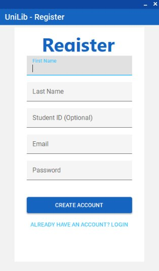
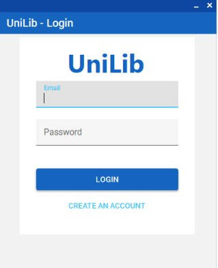
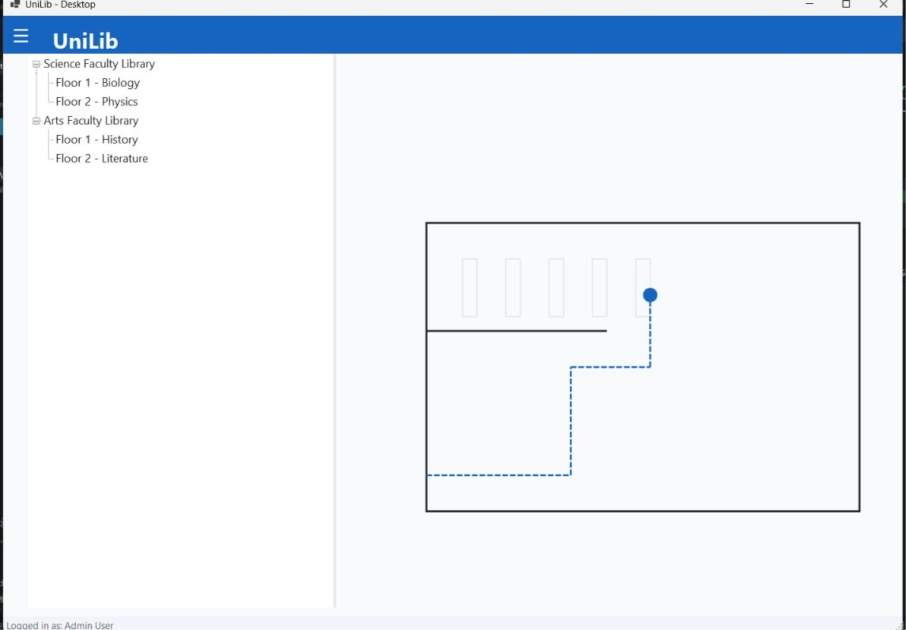
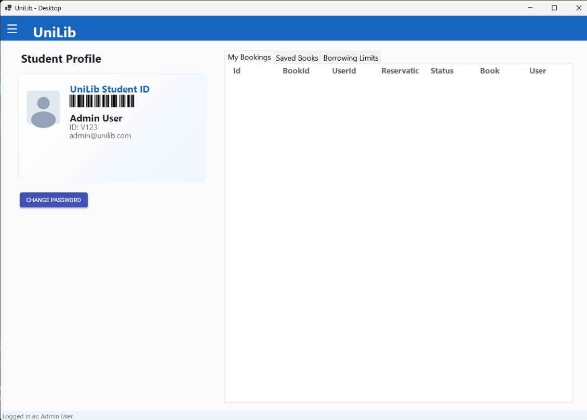
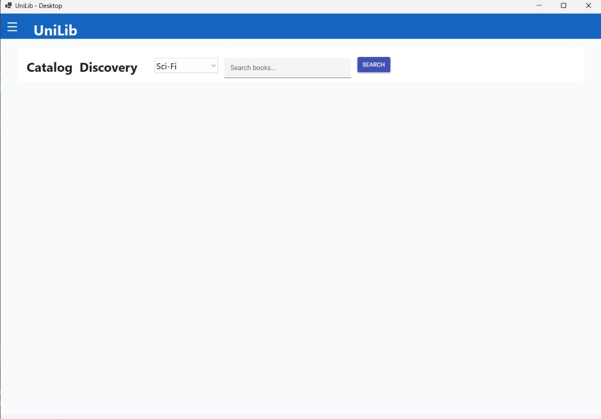

# Львівський національний університет імені Івана Франка

**Факультет прикладної математики та інформатики**  
Кафедра програмування

## Звіт
### етапу виконання проєкту №5

**«Створення початкової структури проєкту»**

**Виконали:** студенти групи ПМІ-33

- Вербова Надія Андріївна
- Махновець Богдан Вікторович
- Митюк Маркіян Андрійович
- Нагірняк Вікторія Іванівна

**Перевірив:** ас. Галамага Любомир Борисович

---

## 1. Мета етапу

Розгортання базової програмної та модульної архітектури бібліотечної системи **UniLib**, організація структури солюшену на базі платформи **.NET 10**, налаштування шарів збереження даних (ORM Entity Framework Core), розробка бізнес-сервісів застосунку, забезпечення ізольованого контуру модульного тестування (xUnit + In-Memory SQLite) та розробка первинних форм графічного інтерфейсу (Windows Forms).

---

## 2. Загальна архітектура рішення

Проєкт організовано за принципами багатошарової архітектури (Layered Architecture) із чітким розділенням зон відповідальності (Separation of Concerns). Рішення складається з двох ключових проєктів:

1. **`unilib`** — основний виконавчий проєкт настільного застосунку (Windows Forms), який містить шари предметної моделі (Domain Models), доступу до даних (Data Access Layer), сервісів бізнес-логіки (Service Layer) та графічного інтерфейсу (UI).
2. **`unilib.Tests`** — проєкт автоматизованого модульного тестування (Unit Testing), що перевіряє коректність виконання бізнес-правил, алгоритмів пошуку та криптографічної обробки паролів в ізольованому in-memory середовищі.

```
Galamaga/
├── unilib/                    # Основний проєкт застосунку
│   ├── Data/                  # Контекст БД та міграції EF Core
│   │   ├── Migrations/
│   │   └── LibraryDbContext.cs
│   ├── Models/                # Доменні моделі сутностей
│   │   ├── User.cs, Role.cs, Book.cs, Author.cs, ...
│   │   └── Statuses.cs
│   ├── Services/              # Сервісний шар бізнес-логіки
│   │   ├── ServiceBase.cs, AuthService.cs, BookService.cs, ...
│   │   └── Session.cs
│   ├── appsettings.json       # Конфігурація підключення до PostgreSQL
│   ├── Form1.cs               # Головне вікно / форми UI
│   ├── Program.cs             # Точка входу в застосунок
│   └── unilib.csproj          # Конфігурація проєкту (.NET 10, WinForms)
├── unilib.Tests/              # Проєкт модульного тестування
│   ├── TestDb.cs              # In-memory SQLite фікстура для тестів
│   ├── AuthServiceTests.cs    # Тести автентифікації та реєстрації
│   ├── BookServiceTests.cs    # Тести пошуку книг та розрахунку залишків
│   ├── LoanServiceTests.cs    # Тести видачі та повернення примірників
│   └── unilib.Tests.csproj    # Конфігурація тестів (xUnit, Coverlet)
└── docs/                      # Проєктна документація та графічні матеріали
```

---

## 3. Опис проєкту `unilib`

Проєкт `unilib` є ядром системи та налаштований під цільову платформу `.NET 10` (`net10.0-windows`) з увімкненими Windows Forms та суворим контролем типів (`Nullable: enable`).

### 3.1. Технологічний стек та залежності

- **Entity Framework Core 10** (`Npgsql.EntityFrameworkCore.PostgreSQL`, `EFCore.NamingConventions`): об'єктно-реляційне відображення даних з автоматичною конвертацією назв таблиць і стовпців у `snake_case` відповідно до стандартів PostgreSQL.
- **ASP.NET Core Identity Core** (`Microsoft.Extensions.Identity.Core`): криптографічно стійке хешування паролів за допомогою алгоритму PBKDF2 із сіллю через `PasswordHasher<User>`.
- **Microsoft.Extensions.Configuration.Json**: керування конфігурацією середовища через файл `appsettings.json`.

### 3.2. Доменні моделі (`Models/`)

У проєкті реалізовано реляційну модель даних, узгоджену з попередніми етапами проєктування:
- **`User`**, **`Role`**: користувачі системи (Студент, Бібліотекар, Адміністратор) із захищеним збереженням хешу пароля та аудитом дати створення.
- **`Faculty`**, **`Library`**: факультети та бібліотечні відділення (адреса, контакти) університету.
- **`Book`**, **`Author`**, **`BookAuthor`**: каталожні книги (ISBN, назва, рік, наявна кількість), автори та зв'язок «багато-до-багатьох».
- **`Category`**: тематичні категорії / жанри літератури.
- **`UserBook` (Loan)**: операції видачі книг користувачеві з фіксацією дати позичення, терміну здачі (`DueDate`), фактичної дати повернення та статусів (`Active`, `Returned`, `Overdue`).
- **`Reservation`**: попереднє бронювання примірників читачем зі станами (`Pending`, `Active`, `Completed`, `Cancelled`).
- **`Favorite`**: список збережених/обраних книг читача.

### 3.3. Шар доступу до даних (`Data/`)

Клас `LibraryDbContext` інкапсулює доступ до бази даних:
- Налаштовано унікальні індекси для `Email`, `StudentId`, `ISBN`, найменувань ролей, категорій та факультетів.
- Визначено правила зовнішніх ключів із поведінкою `DeleteBehavior.Restrict` для збереження цілісності історії видач.
- Додано початкове наповнення бази даних (Seeding) базовими системними ролями: *Admin*, *Librarian*, *Student*.
- Створено механізм міграцій EF Core (`Migrations/`) для контрольованого розгортання схеми БД.

### 3.4. Сервісний шар бізнес-логіки (`Services/`)

Всі операції уніфіковано через абстрактний базовий клас `ServiceBase`, що реалізує патерн короткоживучих контекстів БД (short-lived `DbContext`) та стандартну трансляцію помилок операцій:
- **`AuthService`**: реєстрація користувачів із валідацією, нормалізацією email, перевіркою унікальності, формуванням безпечного сольованого хешу пароля; вхід користувача та зміна пароля.
- **`BookService`**: універсальний нечутливий до регістру пошук за назвою, ISBN або авторами (`SearchAsync`); динамічний підрахунок доступних для видачі фізичних примірників (`GetAvailableCopiesAsync = TotalAmount - ActiveLoans`).
- **`LoanService`**: оформлення видачі примірника зі встановленням статусу `Active` та дедлайну; фіксація повернення книги з автоматичним оновленням дати та контролем повторних дій.
- **`ReservationService`**: життєвий цикл резервування книг читачами та обробка запитів бібліотекарем.
- **`FacultyService`, `LibraryService`, `CategoryService`, `AuthorService`, `UserService`, `RoleService`, `FavoriteService`, `Session`**: підтримка повного життєвого циклу відповідних сутностей і поточної сесії користувача.

---

## 4. Опис проєкту `unilib.Tests`

Проєкт `unilib.Tests` побудований на базі фреймворку **xUnit** і забезпечує тестування ключових модулів системи.

### 4.1. Архітектура тестового контуру (`TestDb.cs`)

Для швидкого виконання модульних тестів без залежності від зовнішнього сервера PostgreSQL розроблено клас `TestDb`:
- Створює ізольоване з'єднання **SQLite In-Memory** (`DataSource=:memory:`).
- Автоматично генерує повну схему бази даних за моделями EF Core (`EnsureCreated()`).
- Гарантує повну ізоляцію кожного тестового сценарію та легковагове очищення ресурсів (`IDisposable`).

### 4.2. Покриття тестовими сценаріями

- **`AuthServiceTests`**:
  - `Register_CreatesStudentWithHashedPassword` — перевірка створення облікового запису студента з автоматичним гешуванням пароля та призначенням ролі.
  - `Register_DuplicateEmail_Throws` — перевірка блокування реєстрації дублікатів адрес електронної пошти (регістронезалежно).
  - `Login_CorrectPassword_ReturnsUserWithRole` — перевірка успішної автентифікації та коректності підвантаження зв'язаної ролі.
  - `Login_WrongPassword_ReturnsNull` / `Login_UnknownEmail_ReturnsNull` — перевірка відхилення невалідних облікових даних.
  - `ChangePassword_ReplacesPassword` / `ChangePassword_WrongOldPassword_Throws` — валідація процедури зміни пароля користувачем.
- **`BookServiceTests`**:
  - `GetByIsbn_IncludesCategoryAndAuthors` — перевірка завантаження повної деталізації книги разом із категорією та авторами.
  - `Search_MatchesTitleAuthorOrIsbn` — параметризоване тестування (`[Theory]`) пошуку книг за фрагментами назви, прізвищем автора та номером ISBN.
  - `GetAvailableCopies_SubtractsOpenLoans` — перевірка точності обчислення вільного залишку примірників з урахуванням активних видач.
- **`LoanServiceTests`**:
  - `Create_MakesActiveLoan` — перевірка створення активної позики зі встановленням дати видачі й кінцевого терміну здачі.
  - `Create_UnknownBook_Throws` — обробка помилки спроби видачі неіснуючої книги.
  - `Return_SetsReturnDateAndStatus` — перевірка переведення статусу в `Returned` та запису поточної дати повернення.
  - `Return_AlreadyReturned_Throws` — захист від повторного повернення вже зданої книги.
  - `GetByUser_IncludesBook` — коректність вибірки історії та активних видач конкретного читача.

---

## 5. Інтерфейс користувача та розроблені екрани системи

У межах етапу розроблено форми користувацького інтерфейсу на платформі Windows Forms, які відповідають затвердженим макетам системи **UniLib**.

### 5.1. Форма реєстрації нового читача (`UniLib - Register`)

Форма забезпечує первинну самостійну реєстрацію студента в системі. Передбачено введення імені, прізвища, опційного номера студентського квитка (Student ID), адреси корпоративної пошти та пароля. Також реалізовано швидкий перехід до форми входу для вже зареєстрованих користувачів.



### 5.2. Форма автентифікації користувача (`UniLib - Login`)

Мінімалістична форма входу для читачів і персоналу бібліотеки. Виконує автентифікацію за парою «Email — Пароль», звертаючись до `AuthService` із верифікацією криптографічного хешу, та пропонує перехід до створення нового облікового запису.



### 5.3. Модуль внутрішньої навігації та мапи бібліотек (`UniLib - Desktop: Map`)

Екран навігації призначений для полегшення орієнтування читача у просторі бібліотечних корпусів університету:
- **Деревоподібна навігація** (ліва панель): ієрархія підрозділів (Science Faculty Library, Arts Faculty Library) з поділом на тематичні поверхи (Floor 1 - Biology, Floor 2 - Physics тощо).
- **Інтерактивна 2D-мапа приміщення** (права панель): відображення плану обраного поверху, розташування книжкових стелажів та динамічне прокладання маршруту (пунктирною лінією) безпосередньо до потрібної шафи чи полиці з обраною книгою (позначено маркером).



### 5.4. Кабінет читача / Студентський профіль (`Student Profile`)

Персональний кабінет користувача, що реалізує концепцію «єдиного цифрового абонемента»:
- **Цифровий квиток читача (UniLib Student ID)**: містить згенерований штрихкод для сканування бібліотекарем на кафедрі видачі, ім'я користувача, персональний ID та електронну адресу, а також кнопку швидкої зміни пароля.
- **Панель керування абонементом**: вкладки «Мої бронювання» (*My Bookings*) із табличним поданням активних замовлень (ідентифікатор, назва книги, дата резервування, поточний статус), «Збережені книги» (*Saved Books*) для швидкого доступу до списку бажаного та «Ліміти видачі» (*Borrowing Limits*).



### 5.5. Модуль пошуку та каталогу (`Catalog Discovery`)

Екран пошуку літератури, оптимізований під швидку роботу користувача:
- **Селектор тематичних категорій**: швидка фільтрація за жанром або галуззю знань (наприклад, *Sci-Fi*, програмування, історія тощо).
- **Рядок пошуку**: миттєвий пошук літератури за ключовими словами, назвою або автором на основі методів `BookService.SearchAsync`.



---

## 6. Висновки

У результаті виконання етапу №5 «Створення початкової структури проєкту»:

1. Сформовано структуроване та розширюване .NET 10 рішення, розбите на продуктовий застосунок `unilib` та проєкт автоматизованого тестування `unilib.Tests`.
2. Реалізовано шар моделей даних і налаштовано контекст `LibraryDbContext` для СУБД PostgreSQL із підтримкою snake_case угод і безпечного зберігання паролів через `PasswordHasher`.
3. Розроблено сервісний шар бізнес-логіки (`AuthService`, `BookService`, `LoanService`, `ReservationService` тощо), що інкапсулює операції з книжковим фондом, реєстрацією користувачів та обліком видач.
4. Створено повноцінний набір модульних тестів (xUnit) на базі in-memory SQLite (`TestDb`), який перевіряє життєвий цикл позик, безпеку автентифікації та алгоритми пошуку літератури.
5. Розроблено робочі форми користувацького інтерфейсу (реєстрація, автентифікація, навігація мапою бібліотеки, персональний профіль студента зі штрихкодом та каталог літератури), які повністю готові до інтеграції з сервісним шаром.
